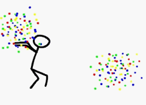

# Dotfiles .:.



My configuration files, managed with [chezmoi](https://www.chezmoi.io/) so a
single repo drives every machine I use: macOS, Linux, Windows, and WSL.

chezmoi does not symlink; it *generates* your real dotfiles from a source tree,
transforming them per-machine via Go templates. That lets one branch serve all
environments instead of a branch per host.

## Install

macOS / Linux / WSL:

```sh
sh -c "$(curl -fsLS https://raw.githubusercontent.com/nixpulvis/dotfiles/master/install.sh)"
```

Windows (PowerShell):

```powershell
irm https://raw.githubusercontent.com/nixpulvis/dotfiles/master/install.ps1 | iex
```

Either bootstrap installs chezmoi (if missing), clones this repo, prompts for
per-machine settings, and applies. On a machine that already has chezmoi:

```sh
chezmoi init --apply nixpulvis
```

To track a work-in-progress branch, pass it through: `./install.sh --branch next`.

## Components

Every machine gets the **base** layer. Extra groups are opt-in and chosen once
during `chezmoi init` (answers persist per machine; re-run `chezmoi init` to
change them).

| Group     | Applies to                     | Contents                                              |
| --------- | ------------------------------ | ----------------------------------------------------- |
| `base`    | everywhere                     | git, bash, fish, vim/nvim, claude, ssh, `bin/`        |
| `gui`     | opt-in (default: desktop OSes) | alacritty + fonts                                     |
| `desktop` | opt-in (Linux only)            | sway, i3, i3blocks, rofi, zathura, `.xinitrc`, `.X`   |

Gating lives in [`home/.chezmoiignore`](home/.chezmoiignore); the prompts and
their OS-aware defaults live in
[`home/.chezmoi.toml.tmpl`](home/.chezmoi.toml.tmpl). WSL is detected
automatically and defaults to a headless (no `gui`/`desktop`) profile.

Packages for the selected groups are installed by
`home/run_once_before_10-install-packages.{sh,ps1}.tmpl` (Homebrew on macOS,
`pacman`/`apt` on Linux, `winget` on Windows).

## Layout

```
.chezmoiroot                 -> points chezmoi at home/
install.sh / install.ps1     bootstrap entrypoints
home/                        chezmoi source (generates ~/)
  .chezmoi.toml.tmpl         per-machine prompts (name/email/gui/desktop)
  .chezmoiignore             component gating
  dot_*                      files that become ~/.*
  run_once_*                 one-time setup scripts
```

## Daily use

```sh
chezmoi edit ~/.gitconfig    # edit the source for a file
chezmoi diff                 # preview changes to $HOME
chezmoi apply                # write changes to $HOME
chezmoi update               # git pull + apply
chezmoi cd                   # shell in the source dir, then git commit/push
```

## Notes

Per-machine identity (personal vs work email, signing key) is answered at
`init` and written into `~/.gitconfig` from a template — no secrets and no
host-specific branches. System-level provisioning (locale, `sudoers`,
`pacman.conf`) that used to live here is out of scope; these are user dotfiles.
